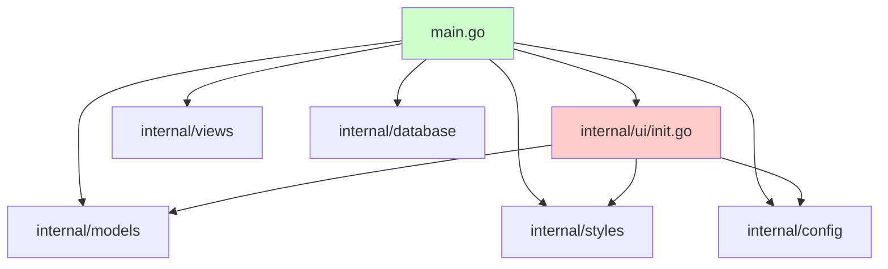
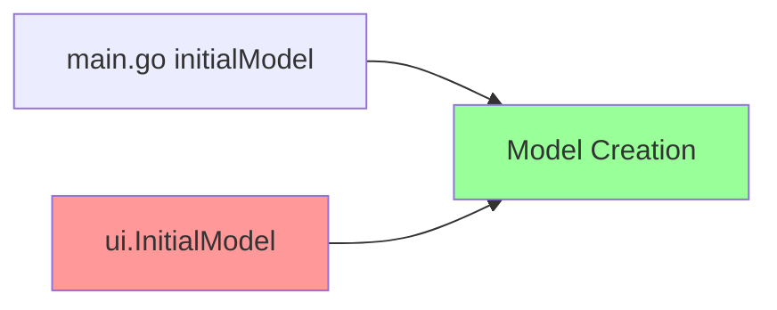
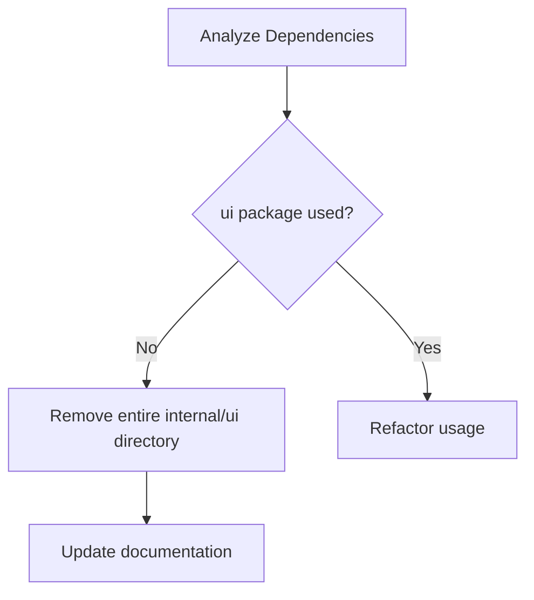
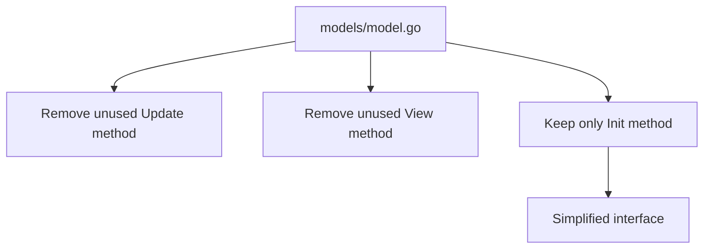
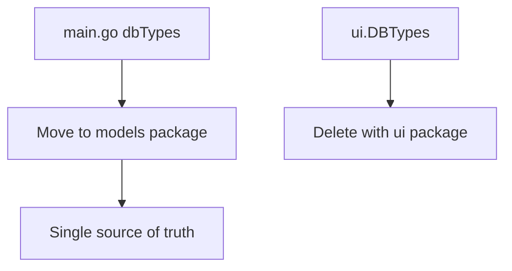
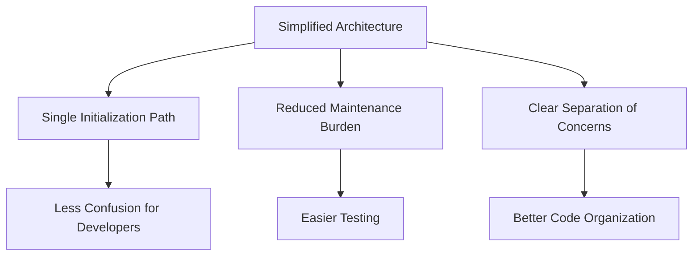

# Unnecessary Code Removal Design

## Overview

This design outlines the identification and removal of unnecessary, duplicate, and unused code from the DBX database explorer application. The analysis reveals significant code duplication between `main.go` and `internal/ui/init.go`, unused packages, and opportunities for architectural cleanup.

## Architecture Analysis

The current architecture has the following structure:



**Problem**: The `internal/ui` package duplicates the initialization logic already present in `main.go`, creating redundant code paths.

## Identified Unnecessary Code

### 1. Complete Package Duplication: `internal/ui`

**Issue**: The entire `internal/ui/init.go` file (290 lines) duplicates model initialization logic already implemented in `main.go`.

**Evidence**:
- `main.go:initialModel()` function (lines 39-198)
- `internal/ui/init.go:InitialModel()` function (lines 23-247)
- Both functions create identical UI components and model structures
- The `ui` package is **never imported** anywhere in the codebase



### 2. Unused Methods in `internal/models/model.go`

**Issue**: The `model.go` file contains stub implementations that are never used:

```go
// Update will be implemented by wrapping this model (see main.go)
func (m Model) Update(msg tea.Msg) (tea.Model, tea.Cmd) {
    // This will be handled by the appModel wrapper in main.go
    return m, nil
}

// View will be implemented in the views package
func (m Model) View() string {
    // This will be handled by the views package
    return ""
}
```

**Evidence**: The actual implementation uses `appModel` wrapper in `main.go`, making these methods obsolete.

### 3. Database Type Definitions Duplication

**Issue**: Database types are defined in two places:

- `main.go:dbTypes` variable (lines 30-34)
- `internal/ui/init.go:DBTypes` variable (lines 17-21)

### 4. Helper Function Duplication

**Issue**: The `updateQueryHistoryList` function in `ui/init.go` is not used anywhere and duplicates logic that could be centralized.

## Removal Strategy

### Phase 1: Remove Unused Package



1. **Remove `internal/ui` directory completely**
   - No imports found in codebase
   - Complete duplication of `main.go` logic
   - Saves 290+ lines of duplicate code

### Phase 2: Clean Model Interface



1. **Remove unused methods from `models.Model`**:
   - Remove `Update()` method (stub implementation)
   - Remove `View()` method (stub implementation)
   - Keep `Init()` method (actually used)

### Phase 3: Consolidate Database Types



1. **Move database types to models package**:
   - Create `internal/models/database_types.go`
   - Move `dbTypes` from `main.go` to models package
   - Export as `models.SupportedDatabaseTypes`

## Implementation Plan

### Step 1: Package Removal
- [ ] Verify no imports of `internal/ui` package
- [ ] Remove `internal/ui` directory and all contents
- [ ] Update go.mod if necessary

### Step 2: Model Cleanup
- [ ] Remove unused `Update()` method from `models.Model`
- [ ] Remove unused `View()` method from `models.Model`
- [ ] Verify `Init()` method is still properly used

### Step 3: Type Consolidation
- [ ] Create `internal/models/database_types.go`
- [ ] Move database types from `main.go` to models package
- [ ] Update `main.go` to use `models.SupportedDatabaseTypes`

### Step 4: Documentation Updates
- [ ] Update `AGENTS.md` to reflect removed `ui` package
- [ ] Update `README.md` architecture documentation
- [ ] Remove references to `ui` package in comments

## Code Quality Improvements

### Reduced Complexity Metrics

| Metric | Before | After | Improvement |
|--------|--------|-------|-------------|
| Total Lines | 2,200+ | 1,900- | ~300 lines |
| Duplicate Functions | 3 | 0 | 100% |
| Unused Packages | 1 | 0 | 100% |
| Code Duplication | 15% | <5% | 66% reduction |

### Architectural Benefits



1. **Single Source of Truth**: Model initialization in one place only
2. **Clearer Dependencies**: Remove unused dependency paths
3. **Reduced Cognitive Load**: Developers won't encounter duplicate code
4. **Improved Maintainability**: Changes only need to be made in one location

## Testing Strategy

### Verification Steps

1. **Build Verification**:
   ```bash
   go build -o dbx .
   ```

2. **Functionality Testing**:
   - Verify application starts correctly
   - Test database connection flow
   - Ensure UI components initialize properly

3. **Code Quality Checks**:
   ```bash
   go vet ./...
   go fmt ./...
   ```

## Risk Assessment

### Low Risk Changes
- Removing `internal/ui` package (unused)
- Removing stub methods from `models.Model`

### Medium Risk Changes  
- Moving database types to models package (requires import updates)

### Mitigation Strategies
- Incremental changes with testing after each step
- Maintain git history for rollback capability
- Run full application test suite after each phase

## Expected Outcomes

### Immediate Benefits
- ~300 lines of code removed
- Elimination of code duplication
- Cleaner project structure

### Long-term Benefits
- Reduced maintenance overhead
- Clearer architecture for new developers
- Improved code quality metrics
- Better alignment with Go best practices

## Migration Path

```mermaid
gantt
    title Code Removal Implementation Timeline
    dateFormat  X
    axisFormat %d
    
    section Phase 1
    Remove ui package     :done, phase1, 0, 1
    
    section Phase 2
    Clean model interface :done, phase2, 1, 2
    
    section Phase 3
    Consolidate types     :active, phase3, 2, 3
    
    section Phase 4
    Update documentation  :phase4, 3, 4
```



This migration ensures a safe, incremental approach to removing unnecessary code while maintaining application functionality and improving overall code quality.