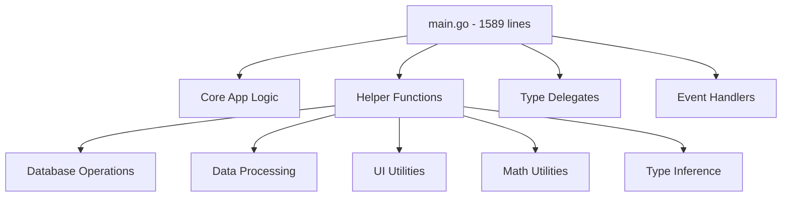
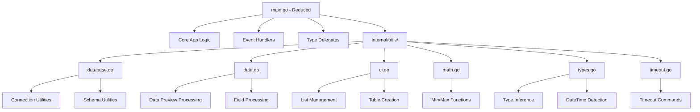
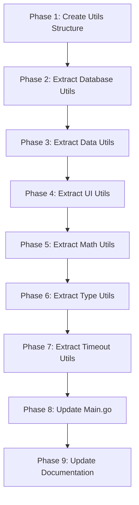

# DBX Utils Package Design

## Overview

This design document outlines the creation of a `utils` package to refactor helper functions from `main.go`, improving code organization, maintainability, and testability in the DBX terminal-based database explorer application.

## Architecture

### Current State Analysis

The current `main.go` file contains approximately 1,589 lines and includes multiple categories of helper functions mixed with core application logic:



### Target Architecture



## Component Design

### Utils Package Structure

```
internal/utils/
├── database.go          # Database connection and schema utilities
├── data.go             # Data processing and manipulation utilities  
├── ui.go               # UI component helper functions
├── math.go             # Mathematical utility functions
├── types.go            # Type inference and validation utilities
└── timeout.go          # Timeout and command utilities
```

### Module Responsibilities

#### 1. Database Utilities (`database.go`)

**Purpose**: Database connection, schema detection, and SQL generation utilities

**Functions to Extract**:
- `getDefaultSchema(driver string) string` - Get default schema name by driver
- `buildUpdateSQL(driver, schema, table, field, primaryKey string) string` - Generate UPDATE SQL
- `findPrimaryKeyColumn(columns []string, rowData []string) (string, string, error)` - Locate primary key

**Interface**:
```go
package utils

// GetDefaultSchema returns the default schema name for a database driver
func GetDefaultSchema(driver string) string

// BuildUpdateSQL generates database-specific UPDATE SQL statement
func BuildUpdateSQL(driver, schema, table, field, primaryKey string) string

// FindPrimaryKeyColumn locates primary key column and value from row data
func FindPrimaryKeyColumn(columns []string, rowData []string) (string, string, error)
```

#### 2. Data Processing Utilities (`data.go`)

**Purpose**: Data manipulation, sorting, and pagination utilities

**Functions to Extract**:
- `determineSortParameters(sortDirection models.SortDirection, sortColumn string) (string, string)` - Convert sort params
- `createTableInfos(tables []string, schema string) []models.TableInfo` - Generate table info objects
- `updateRowDetailList(columns []string, rowData []string) []list.Item` - Create row detail items

**Interface**:
```go
package utils

// DetermineSortParameters converts internal sort parameters to SQL format
func DetermineSortParameters(sortDirection models.SortDirection, sortColumn string) (string, string)

// CreateTableInfos generates TableInfo objects from table names
func CreateTableInfos(tables []string, schema string) []models.TableInfo

// UpdateRowDetailList creates list items for row detail view
func UpdateRowDetailList(columns []string, rowData []string) []list.Item
```

#### 3. UI Component Utilities (`ui.go`)

**Purpose**: UI component creation, sizing, and table management

**Functions to Extract**:
- `createDataPreviewTable(m models.Model) models.Model` - Build data preview table with scrolling
- `updateSavedConnectionsList(m models.Model) models.Model` - Refresh connections list
- `calculateColumnWidths(columns []string, rows [][]string) []int` - Compute optimal column widths
- `createVisibleColumnsAndRows(columns []string, rows [][]string, scrollOffset, visibleCols int, colWidths []int) ([]table.Column, []table.Row)` - Handle horizontal scrolling

**Interface**:
```go
package utils

// CreateDataPreviewTable builds a data preview table with horizontal scrolling support
func CreateDataPreviewTable(m models.Model) models.Model

// UpdateSavedConnectionsList refreshes the saved connections list items
func UpdateSavedConnectionsList(m models.Model) models.Model

// CalculateColumnWidths computes optimal column widths based on content
func CalculateColumnWidths(columns []string, rows [][]string) []int

// CreateVisibleColumnsAndRows handles horizontal scrolling for tables
func CreateVisibleColumnsAndRows(columns []string, rows [][]string, scrollOffset, visibleCols int, colWidths []int) ([]table.Column, []table.Row)
```

#### 4. Mathematical Utilities (`math.go`)

**Purpose**: Basic mathematical operations and calculations

**Functions to Extract**:
- `min(a, b int) int` - Return minimum of two integers
- `max(a, b int) int` - Return maximum of two integers
- `calculateTotalPages(totalRows, itemsPerPage int) int` - Compute pagination

**Interface**:
```go
package utils

// Min returns the minimum of two integers
func Min(a, b int) int

// Max returns the maximum of two integers  
func Max(a, b int) int

// CalculateTotalPages computes total pages for pagination
func CalculateTotalPages(totalRows, itemsPerPage int) int
```

#### 5. Type Inference Utilities (`types.go`)

**Purpose**: Data type detection and validation

**Functions to Extract**:
- `inferFieldType(value string) string` - Detect field data type
- `looksLikeDateTime(s string) bool` - DateTime format detection
- `sanitizeValueForDisplay(value string) string` - Clean value for UI display

**Interface**:
```go
package utils

// InferFieldType detects the data type of a field value
func InferFieldType(value string) string

// LooksLikeDateTime attempts to detect datetime format
func LooksLikeDateTime(s string) bool

// SanitizeValueForDisplay cleans values for single-line UI display
func SanitizeValueForDisplay(value string) string
```

#### 6. Timeout Utilities (`timeout.go`)

**Purpose**: Timeout commands and async operations

**Functions to Extract**:
- `clearResultAfterTimeout() tea.Cmd` - Clear result messages with timeout

**Interface**:
```go
package utils

// ClearResultAfterTimeout returns a command to clear result messages after 3 seconds
func ClearResultAfterTimeout() tea.Cmd
```

## Implementation Strategy

### Refactoring Approach

1. **Create Utils Package Structure**
   - Create `internal/utils/` directory
   - Create individual utility files with appropriate package declarations

2. **Extract Functions by Category**
   - Move functions to appropriate utility files
   - Update function signatures to be exported (capitalize names)
   - Add comprehensive documentation

3. **Update Main.go Imports**
   - Add import for `internal/utils`
   - Update function calls to use utils package prefix

4. **Update Dependencies**
   - Ensure all utility functions import required dependencies
   - Maintain separation of concerns between utility categories

### Migration Plan



## Testing Strategy

### Unit Test Structure

```
internal/utils/
├── database_test.go
├── data_test.go
├── ui_test.go
├── math_test.go
├── types_test.go
└── timeout_test.go
```

### Test Coverage Requirements

- **Database Utils**: Test schema detection, SQL generation, primary key finding
- **Data Utils**: Test sorting parameters, table info creation, list updates
- **UI Utils**: Test column width calculation, table creation logic
- **Math Utils**: Test min/max functions, pagination calculations
- **Type Utils**: Test type inference accuracy, datetime detection
- **Timeout Utils**: Test command generation

### Example Test Implementation

```go
func TestInferFieldType(t *testing.T) {
    tests := []struct {
        name     string
        value    string
        expected string
    }{
        {"null value", "NULL", "NULL"},
        {"integer", "123", "Int"},
        {"float", "123.45", "Float"},
        {"boolean true", "true", "Bool"},
        {"json object", `{"key": "value"}`, "JSON"},
        {"datetime", "2023-01-01 10:00:00", "DateTime"},
        {"text", "hello world", "Text"},
    }
    
    for _, tt := range tests {
        t.Run(tt.name, func(t *testing.T) {
            result := utils.InferFieldType(tt.value)
            if result != tt.expected {
                t.Errorf("InferFieldType(%q) = %q, expected %q", tt.value, result, tt.expected)
            }
        })
    }
}
```

## Documentation Updates

### README.md Changes

Update the architecture section to reflect the new utils package:

```markdown
## Architecture

```
dbx/
├── main.go                     # Main entry point with update logic
├── internal/
│   ├── config/                 # Configuration and file storage
│   ├── database/               # Database operations and adapters
│   ├── models/                 # Core types and interfaces
│   ├── styles/                 # UI theming
│   ├── utils/                  # Helper functions and utilities
│   └── views/                  # UI view rendering
```

### AGENTS.md Changes

Update the project structure and coding guidelines:

```markdown
## Project Structure & Modules
- `internal/`: application packages
  - `config/` (storage, persistence)
  - `database/` (DB queries and adapters)
  - `models/` (core types and state)
  - `styles/` (theme/styling)
  - `utils/` (helper functions and utilities)
  - `views/` (UI view rendering)
```

Add utils-specific guidelines:

```markdown
## Utils Package Guidelines
- **Purpose**: Central location for reusable helper functions
- **Organization**: Functions grouped by domain (database, UI, data, etc.)
- **Testing**: Each utils file must have corresponding test file
- **Dependencies**: Utils should not depend on main application state
- **Exports**: All utility functions must be exported and documented
```

## Error Handling Strategy

### Error Propagation

```go
// Example: Database utility with proper error handling
func FindPrimaryKeyColumn(columns []string, rowData []string) (string, string, error) {
    // Look for common primary key patterns
    for i, col := range columns {
        if col == "id" || col == "Id" || col == "ID" {
            if i < len(rowData) {
                return col, rowData[i], nil
            }
        }
    }
    
    // Try secondary patterns
    for i, col := range columns {
        colLower := strings.ToLower(col)
        if strings.HasSuffix(colLower, "_id") || strings.HasSuffix(colLower, "id") {
            if i < len(rowData) {
                return col, rowData[i], nil
            }
        }
    }
    
    return "", "", fmt.Errorf("no primary key column found in %d columns", len(columns))
}
```

### Validation Functions

```go
// Input validation for utility functions
func ValidateTableCreationParams(columns []string, rows [][]string, scrollOffset, visibleCols int) error {
    if len(columns) == 0 {
        return fmt.Errorf("columns cannot be empty")
    }
    if scrollOffset < 0 {
        return fmt.Errorf("scroll offset cannot be negative")
    }
    if visibleCols <= 0 {
        return fmt.Errorf("visible columns must be positive")
    }
    if scrollOffset >= len(columns) {
        return fmt.Errorf("scroll offset %d exceeds available columns %d", scrollOffset, len(columns))
    }
    return nil
}
```

## Performance Considerations

### Memory Optimization

- **String Processing**: Use `strings.Builder` for concatenation in loops
- **Slice Management**: Pre-allocate slices with known capacity
- **Column Width Caching**: Cache calculated column widths to avoid recomputation

### Computational Efficiency

```go
// Optimized column width calculation
func CalculateColumnWidths(columns []string, rows [][]string) []int {
    colWidths := make([]int, len(columns))
    
    // Initialize with header lengths
    for i, col := range columns {
        colWidths[i] = len(col)
    }
    
    // Single pass through all data
    for _, row := range rows {
        for i, cell := range row {
            if i < len(colWidths) {
                cellLength := len(cell)
                if cellLength > 40 {
                    cellLength = 40 // Cap at maximum display width
                }
                if cellLength > colWidths[i] {
                    colWidths[i] = cellLength
                }
            }
        }
    }
    
    // Apply minimum width constraints
    for i := range colWidths {
        if colWidths[i] < 8 {
            colWidths[i] = 8
        } else if colWidths[i] > 40 {
            colWidths[i] = 40
        }
    }
    
    return colWidths
}
```